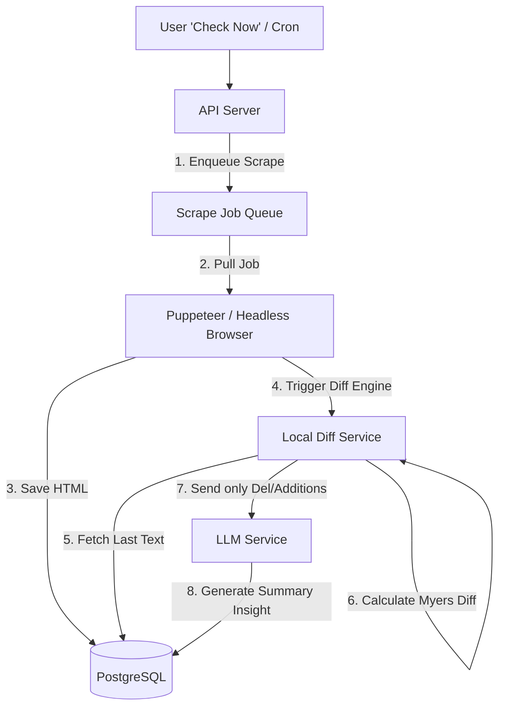

# Q10. Competitive Intelligence Tracker

## 1. Problem Statement
Build an application that monitors 5–10 competitor URLs (pricing, docs, etc.). Upon running a manual or scheduled check, the system crawls the pages, locally calculates the literal text differences, and relies on an LLM to generate a digested, human-readable summary of what actually changed.

## 2. Requirements
1. Allow users to input competitor URLs.
2. Provide an on-demand "Check Now" triggering mechanism.
3. Crawl the live web page safely.
4. Diff the newly fetched text against the formally stored check.
5. Provide this literal diff to an LLM to summarize meaningful product/pricing developments.
6. Display a history table of checks per URL.

## 3. Follow-up Questions
* How do you prevent passing entire webpage HTML schemas to the LLM (wasting tokens)?
* How do you handle sites heavily obfuscated by JavaScript frameworks (React/Vue) where traditional HTML scraping fails?
* How avoid false positives (e.g., dynamically rotating timestamps or ads)?

---

## 4. Schema Design (Fields)

* **`Targets`**: `id`, `name`, `url`, `cron_schedule`
* **`Scrapes`**: `id`, `target_id`, `raw_html`, `extracted_text`, `status`, `created_at`
* **`Insights`**: `id`, `current_scrape_id`, `previous_scrape_id`, `diff_patch_payload`, `ai_summary`, `significance_score`

---

## 5. High-Level Design (HLD) & Explanatory Walkthrough



### Explanatory Walkthrough (Teaching Notes)
An inexperienced candidate will fetch the whole webpage, send the entire raw HTML dump to an LLM, and ask, "What changed?" This will easily breach context windows, cost thousands of dollars, and result in terrible hallucinations.

1. **Headless Scraping**: Use a service like Puppeteer or Firecrawl. Static HTML fetching (like `axios`) misses data loaded via API calls in SPAs. Let the DOM render first.
2. **Cleaning**: Before saving the `extracted_text`, strip out `<nav>`, `<footer>`, `<script>`, `<style>`. Use Mozilla's Readability.js to pull the core article/pricing content.
3. **Local Text Diffing**: Use a library implementing the Myers Diff Algorithm (like `diff-match-patch`). Determine exactly what strings were deleted and added.
4. **Targeted AI Summarization**: We create a prompt containing ONLY the added/removed paragraphs and ask the LLM: "Identify if these text changes indicate a substantive feature release or price hike. Ignore typo optimizations."

---

## 6. LLD, Thought Process & Failure Handling

* **Bot Mitigation Models**:
  Competitor domains will block IPs making repeated non-browser requests. You must configure the headless crawler with rotating proxies and spoofed user agents, or delegate crawling to an established scraper API (e.g., BrightData).
* **DOM Jitter (False Positives)**:
  Pages often rotate IDs (like CSS Modules `class="btn-abc12" -> btn-xyz98`). This is why diffing literal extracted text is vastly superior to diffing raw HTML elements.

---

## 7. Follow-up SQL Queries

**1. Locate the Previous Scrape for Diffing Check:**  
```sql
SELECT id, extracted_text 
FROM scrapes 
WHERE target_id = 'target-url-123' AND status = 'success'
ORDER BY created_at DESC 
LIMIT 1 OFFSET 1; -- Get the one right before current
```

**2. List Significant Changes Only:**  
```sql
SELECT t.name, i.ai_summary, i.significance_score
FROM insights i
JOIN scrapes s ON i.current_scrape_id = s.id
JOIN targets t ON s.target_id = t.id
WHERE i.significance_score > 7; -- High importance threshold
```

<script type="module">
  import mermaid from 'https://cdn.jsdelivr.net/npm/mermaid@10/dist/mermaid.esm.min.mjs';
  mermaid.initialize({ startOnLoad: false });
  document.addEventListener("DOMContentLoaded", function() {
    const blocks = document.querySelectorAll('pre code.language-mermaid');
    blocks.forEach(function(block) {
      const div = document.createElement('div');
      div.className = 'mermaid';
      div.textContent = block.textContent;
      const parent = block.closest('.highlighter-rouge') || block.closest('pre');
      if (parent) {
        parent.replaceWith(div);
      }
    });
    mermaid.run();
  });
</script>
