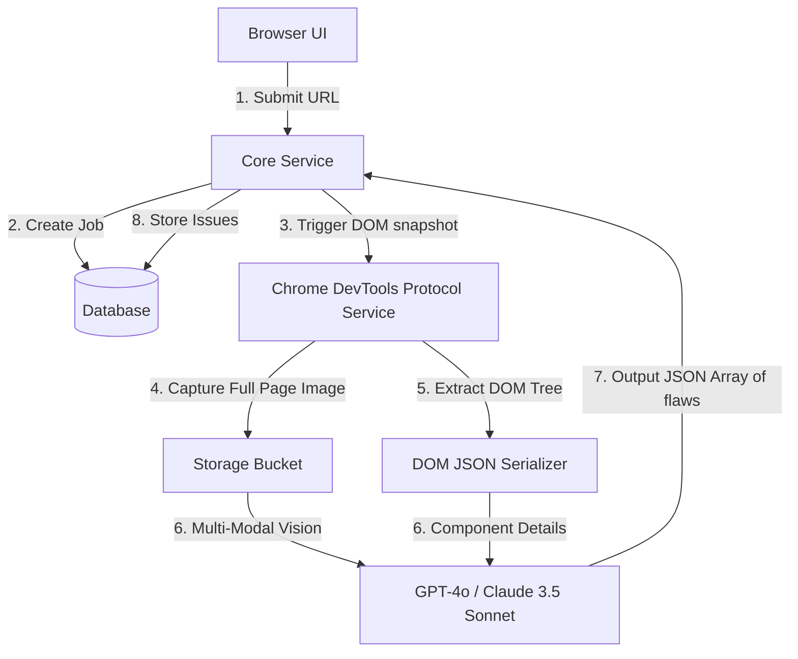

# Q11. Website UX Reviewer

## 1. Problem Statement
Build an application where a user pastes a website URL, and the system runs a deep heuristics analysis using an agentic AI process. It identifies 8-12 definitive UI/UX issues, categorizes them, extracts literal DOM evidence or visual proofs of the flaws, highlights them, and provides "before-and-after" remedies.

## 2. Requirements
1. Accept web URL input.
2. Intelligently load the page, capturing the Document Object Model (DOM) and rendering screenshots.
3. Pass inputs to a multi-modal agentic schema to discover structural, visual, and accessibility gaps.
4. Issue actionable evidence (showing exactly which DOM element or block of text is bad).
5. Suggest remediation codes/designs for the 3 largest issues.
6. Save and browse history of run audits.

## 3. Follow-up Questions
* Is this best solved using text evaluation (HTML) or Vision evaluations (Screenshots)?
* How do you map a Vision LLM's spatial criticism back onto a CSS coordinate or DOM element to show the user exactly where the flaw is?

---

## 4. Schema Design (Fields)

* **`Audits`**: `id`, `url`, `device_viewport` (mobile, desktop), `page_screenshot_s3`, `status`
* **`Issues`**: `id`, `audit_id`, `category` (Clarity, Accessibility, Contrast), `description_why`, `evidence_snippet` (HTML block or cropped image URL), `before_code`, `after_reco`

---

## 5. High-Level Design (HLD) & Explanatory Walkthrough



### Explanatory Walkthrough (Teaching Notes)
An advanced UX Review tool cannot rely purely on text extraction. A button might be functionally sound in HTML but totally hidden via absolute CSS positioning. Therefore, a **Multi-Modal architecture** is mandatory.

1. **Rich Capture Phase**: A headless runner (using Playwright or CDP) visits the target URL. It takes a high-res full-page screenshot. Simultaneously, it extracts an optimized JSON tree mapping DOM elements (`<div id="cta">`) to their bounding box coordinates (X, Y dimensions).
2. **Injected Bounds (Set of Mark)**: To help the Vision model, we optionally draw bounding boxes with numerical IDs directly onto the screenshot before sending it. 
3. **Multi-Modal Fusion**: We prompt the Vision LLM with both the screenshot AND the JSON map. "Look at element #42. Is the color contrast accessible? If not, return JSON highlighting element ID #42." This bridges spatial reasoning with raw code reference.

---

## 6. LLD, Thought Process & Failure Handling

* **Vision Hallucinations (`Element Not Found`)**:
  Vision models frequently hallucinate text or suggest a fix for a button that doesn't exist in the parsed DOM. In the backend, before saving the `Issue`, we perform an integrity mapping cross-check: "Does the text snippet the LLM complained about actually reside in the raw Extracted Text bundle?" Provide fallback defaults if the proof mapping fails.
* **Consent & Sandboxing**:
  Users might input malicious links (e.g., IP loggers or internal network routing attacks like SSRF). The headless browser fetching the data must be isolated in a secured container cluster without access to your backend AWS VPC internals.

---

## 7. Follow-up SQL Queries

**1. Read the Audit Report for Frontend Display:**  
```sql
SELECT i.category, i.description_why, i.evidence_snippet, i.before_code, i.after_reco
FROM issues i
WHERE i.audit_id = 'audit-uuid'
ORDER BY i.category ASC;
```

**2. Analytics: Find Most Common UX Failure Categories:**  
```sql
SELECT category, COUNT(*) as failure_freq
FROM issues
GROUP BY category
ORDER BY failure_freq DESC
LIMIT 5;
```

**3. Retrieve Historical Audits for the Landing Page Dashboard:**  
```sql
SELECT url, status, created_at, 
       (SELECT COUNT(*) FROM issues WHERE audit_id = a.id) as total_issues
FROM audits a
ORDER BY created_at DESC
LIMIT 5;
```

<script type="module">
  import mermaid from 'https://cdn.jsdelivr.net/npm/mermaid@10/dist/mermaid.esm.min.mjs';
  mermaid.initialize({ startOnLoad: false });
  document.addEventListener("DOMContentLoaded", function() {
    const blocks = document.querySelectorAll('pre code.language-mermaid');
    blocks.forEach(function(block) {
      const div = document.createElement('div');
      div.className = 'mermaid';
      div.textContent = block.textContent;
      const parent = block.closest('.highlighter-rouge') || block.closest('pre');
      if (parent) {
        parent.replaceWith(div);
      }
    });
    mermaid.run();
  });
</script>
