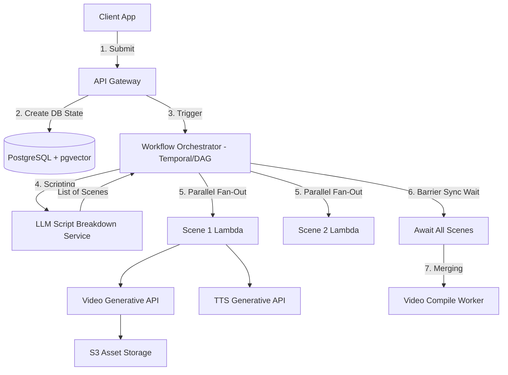

# Q1. AI Video Generation Platform

## 1. Problem Statement
You are building a backend system for an AI video creation platform. Users can input a text prompt (e.g., “Create a 30-sec ad for a coffee brand”), and the system generates a complete video.

## 2. Requirements
1. Accept a text prompt and optional style inputs (tone, duration, format).
2. Break the prompt into scenes and generate:
    * visuals (image/video model)
    * audio (voiceover/music)
3. Merge scenes into a final video.
4. Persist all intermediate assets (scripts, scenes, media files).
5. Return video status and allow users to fetch/download the final output.
6. Support retries for failed scene generation.
7. Provide real-time progress updates.

## 3. Follow-up Questions
* How will you design schemas for prompts, scenes, and assets?
* How will you orchestrate multi-step AI workflows?
* How do you handle partial failures (1 scene fails)?
* How will you optimize cost for repeated prompts?

---

## 4. Schema Design (Fields)

* **`Projects`**: `id`, `user_id`, `original_prompt`, `prompt_embedding` (VECTOR(1536) - pgvector), `status`, `final_video_url`, `created_at`
* **`Scenes`**: `id`, `project_id`, `sequence_number`, `visual_prompt`, `audio_script`, `status`, `retry_count`
* **`Assets`**: `id`, `scene_id`, `asset_type` (audio, image, video), `s3_url`, `provider_latency_ms`

---

## 5. High-Level Design (HLD) & Explanatory Walkthrough



### Explanatory Walkthrough (Teaching Notes)
When approaching a system that generates a multi-scene video, the biggest architectural hurdle is that rendering scenes sequentially takes far too long. If a 10-scene video takes 1 minute per scene, a sequential approach leaves the user waiting 10 minutes.

**1. The Flow Checkpoint**: The client submits the prompt. The API creates a `Project` in the database and immediately returns an HTTP 202 with the `project_id`. The client relies on WebSockets for further updates.
**2. DAG Orchestration**: We pass the job to a DAG orchestrator (like Temporal or AWS Step Functions). The first node passes the prompt to an LLM. The LLM breaks the text into 10 distinct scenes. 
**3. The Fan-out Pattern**: The orchestrator spawns 10 parallel serverless workers simultaneously. Worker 1 handles Scene 1, Worker 2 handles Scene 2. Generating all 10 scenes now takes roughly 1 minute combined, safely bypassing API latency bottlenecks.
**4. The Fan-in Pattern**: The orchestrator pauses at a "Barrier Sync Phase"—waiting until all 10 workers have reported success. Finally, it triggers a single heavy FFmpeg worker to stitch the generated S3 visual and audio assets together.

---

## 6. LLD, Thought Process & Failure Handling

* **Handling Partial Failures (Scene Retries)**: 
  Because we isolated scenes to individual workers using the Orchestrator, if Worker 4 hits an API `429 Rate Limit` from the Video Generator provider, we do not fail the whole project. The Orchestrator natively catches the exception for Worker 4 and applies an exponential backoff. The other 9 scenes succeed and wait safely without re-computation.
* **Optimizing Cost for Repeated Prompts (Semantic Vector Caching)**: 
  Using pure Hash string caching is too rigid ("coffee cup" vs. "cup of coffee" miss). By integrating `pgvector` inside PostgreSQL, we convert the user's prompt into an Embedding text vector. Before running the AI pipeline, we query Postgres to see if a past video had a 98% similarity score to this new prompt. If so, we reuse the old video and bypass the GPU entirely.

---

## 7. Follow-up SQL Queries

**1. Fetch Progress Updates:**  
*Powers the frontend UI iteratively.*
```sql
SELECT s.sequence_number, s.status, a.asset_type, a.s3_url
FROM scenes s
LEFT JOIN assets a ON s.id = a.scene_id
WHERE s.project_id = 'user-project-uuid'
ORDER BY s.sequence_number ASC;
```

**2. Semantic Vector Query (Caching):**  
*Execute a Cosine Similarity Search (`<=>`) in SQL to find mathematically identical prompts generated in the past.*
```sql
SELECT final_video_url, 1 - (prompt_embedding <=> '[0.124, 0.551, ...]') AS similarity
FROM projects
WHERE status = 'complete' 
  AND 1 - (prompt_embedding <=> '[0.124, 0.551, ...]') > 0.98
ORDER BY similarity DESC
LIMIT 1;
```

**3. Idempotency Check (Race Condition Lock):**  
*Guarantees a lambda execution does not duplicate rendering for a scene.*
```sql
UPDATE scenes 
SET status = 'generating' 
WHERE id = 'scene-id' AND status = 'pending' 
RETURNING id;
```

**4. Garbage Collection (Orphaned Assets):**  
*Find stray generated assets mapped to scenes that never completed compilation, saving massive AWS S3 costs.*
```sql
SELECT a.id, a.s3_url, s.project_id
FROM assets a
JOIN scenes s ON a.scene_id = s.id
WHERE s.status = 'failed' OR s.status = 'abandoned';
```

**5. System Observability Engine:**  
*What is the platform's video generation success conversion rate today?*
```sql
SELECT 
    COUNT(*) FILTER (WHERE status = 'complete') * 100.0 / COUNT(*) AS completion_success_rate 
FROM projects
WHERE created_at >= NOW() - INTERVAL '24 hours';
```
