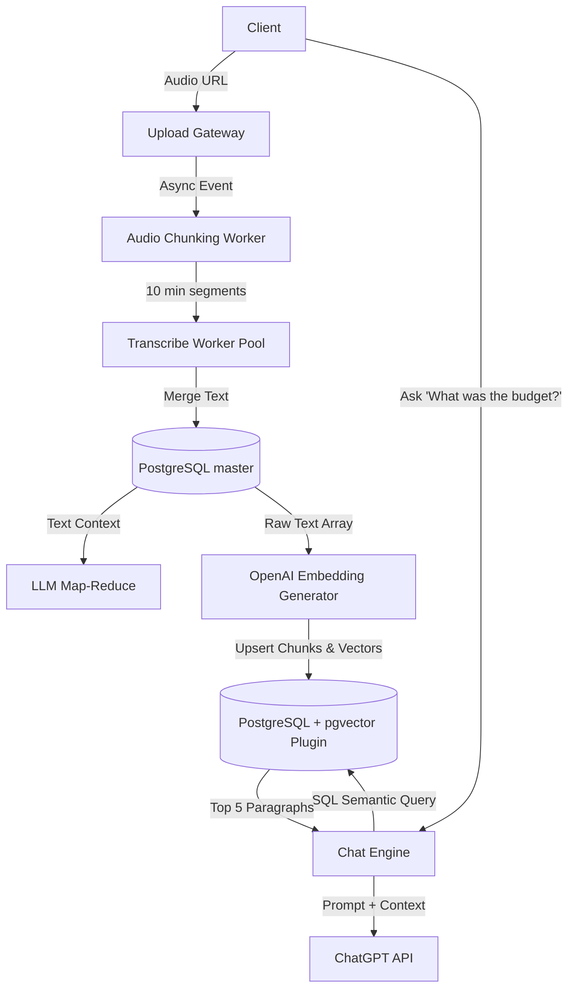

# Q2. AI Audio Intelligence + Chat System

## 1. Problem Statement
You are building a system where users upload audio files (calls, meetings). The system extracts insights and allows users to chat with the content.

## 2. Requirements
1. Fetch audio from a URL.
2. Run speech-to-text and store transcript.
3. Generate summary and key insights.
4. Allow users to ask questions on the transcript.
5. Maintain chat history per user/session.
6. Support streaming responses for chat answers.
7. Handle long audio via chunking + parallel processing.

## 3. Follow-up Questions
* How will you design schema for transcripts, chunks, and chat history?
* How will you store embeddings and retrieve context?
* How will you manage context window limits?
* How will you handle multi-user concurrency?

---

## 4. Schema Design (Fields)

* **`AudioSources`**: `id`, `user_id`, `source_url`, `duration_secs`, `status`
* **`Transcripts`**: `id`, `audio_id`, `raw_text`, `summary_json`
* **`TranscriptChunks`**: `id`, `transcript_id`, `start_timestamp`, `chunk_text`, `embedding_vector` (VECTOR(1536) - pgvector)
* **`ChatSessions`**: `id`, `user_id`, `audio_id`, `created_at`
* **`ChatMessages`**: `id`, `session_id`, `role` (user/ai), `content`, `cited_chunk_ids` (List), `created_at`

---

## 5. High-Level Design (HLD) & Explanatory Walkthrough



### Explanatory Walkthrough (Teaching Notes)
When architects design Audio Intelligence platforms, the biggest trap is treating a 3-hour audio file as one monolithic block. 

1. **Parallelizing STT Integration**: When a user submits an audio URL, our pipeline downloads the asset. A `Chunking Worker` physically splits the MP3 into dozens of 5-minute clips. We place 20 concurrent messages onto a Queue. Effectively, 20 parallel Speech-To-Text GPU instances spin up. A 3-hour file transcribes as fast as a 5-minute file.

2. **Managing Knowledge Extraction (Vector DB over SQL)**: Now we have a giant text wall. Rather than paying for Pinecone, we install the `pgvector` extension natively into Postgres. We instruct OpenAI to convert the text chunks into mathematical arrays (Embeddings). We store the text and the vectors side-by-side in PostgreSQL.

3. **The Chat Loop**: When the user asks a question, we convert their physical question into a Vector. We query Postgres natively utilizing Cosine Similarity equations against the vector column to pull back the 5 closest matching transcript paragraphs. We stuff these paragraphs invisibly into the LLM prompt, and the AI streams back a contextual reply (RAG).

---

## 6. LLD, Thought Process & Failure Handling

* **Managing Context Window Limits**:
  If a podcast transcript is 60,000 words, you cannot pass it into an LLM blindly. By chunking the transcript into 500-word blocks and only sending the Top 5 most relevant blocks (via pgvector) to the LLM, we keep context usage tightly under 3,000 tokens while retaining total accuracy.

* **Handling Multi-User Concurrency**:
  Each WebSocket stream is stateless. When the LLM generates a streamed token, the backend routes it via Redis Pub/Sub directly to the user socket, dropping the memory payload immediately.

* **Vector DB Leaks (Multi-tenant isolation)**:
  Operating Pinecone requires complex metadata filtering. Using `pgvector` natively in Postgres is incredibly safe because tenant isolation uses standard SQL relationships: `JOIN audio_sources WHERE user_id = $1`. It is mathematically impossible for data to leak across users at the query layer.

---

## 7. Follow-up SQL Queries

**1. RAG Vector DB Execution (Cosine Semantic Search):**  
*Instead of Pinecone APIs, you execute standard SQL that performs vector math natively inside Postgres to pull the 5 most relevant paragraphs.*
```sql
SELECT chunk_text, 1 - (embedding_vector <=> '[0.012, 0.441, ...]') AS semantic_similarity
FROM transcript_chunks
WHERE transcript_id = 'active-transcript-uuid'
ORDER BY embedding_vector <=> '[0.012, 0.441, ...]' ASC
LIMIT 5;
```

**2. Hydrating Chat Context:**  
*Pull the most recent Chat History to ground the LLM in the current conversation logic alongside the RAG injected above.*
```sql
SELECT role, content 
FROM chat_messages 
WHERE session_id = 'active-session-uuid' 
ORDER BY created_at DESC 
LIMIT 10;
```

**3. Temporal Reconstruction:**  
*Find the chronological transcript blocks required to rebuild the transcription page UI fully.*
```sql
SELECT start_timestamp, chunk_text
FROM transcript_chunks
WHERE transcript_id = 'transcript-uuid'
ORDER BY start_timestamp ASC;
```

**4. Engagement Analytics:**  
*Which audio transcript uploads have sparked the most intense AI chat sessions from users?*
```sql
SELECT a.id, COUNT(c.id) AS total_chat_sessions
FROM audio_sources a
JOIN chat_sessions c ON a.id = c.audio_id
GROUP BY a.id
ORDER BY total_chat_sessions DESC
LIMIT 5;
```

**5. RAG Quality Tuning:**  
*By storing 'cited_chunk_ids', we can track exactly which Vector DB chunks the LLM keeps referencing. This identifies the most critical components of meetings natively.*
```sql
SELECT c.chunk_id, COUNT(*) as citation_count
FROM chat_messages m, unnest(m.cited_chunk_ids) AS c(chunk_id)
GROUP BY c.chunk_id
ORDER BY citation_count DESC 
LIMIT 10;
```
