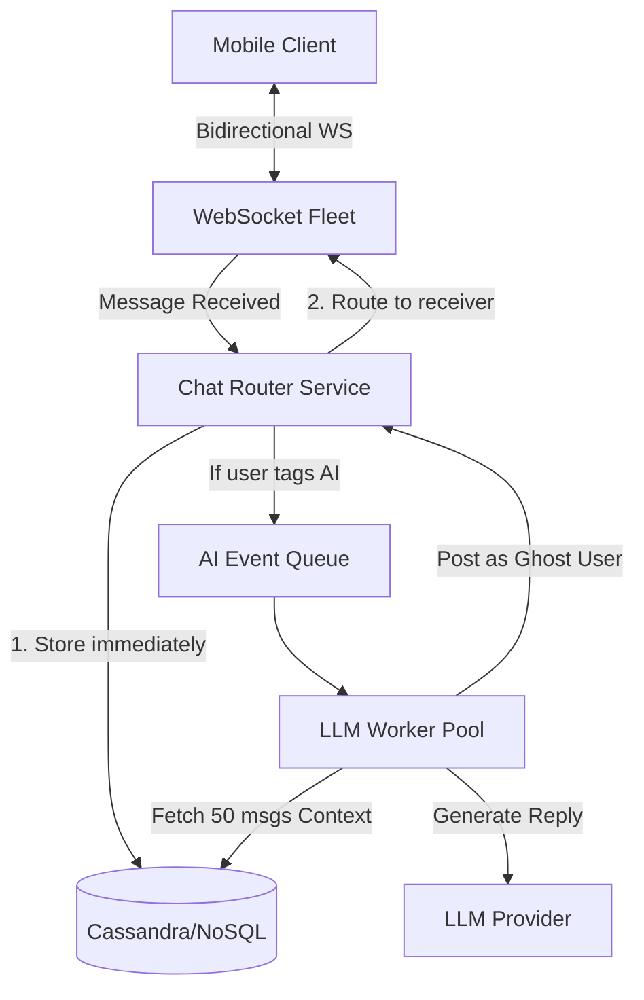

# Q3. WhatsApp-like AI Chat System

## 1. Problem Statement
Design a backend for a WhatsApp-like chat application with AI-powered responses. The system should show the top 5 most recent chats for a user and allow AI-assisted conversations.

## 2. Requirements
1. Users can send/receive messages (1:1 chat).
2. Maintain chat threads and message history.
3. Show top 5 recent conversations per user.
4. Integrate an AI assistant that can:
    * summarize chats
    * reply to messages using context
5. Store conversation context for follow-ups.
6. Ensure low latency for message delivery.

## 3. Follow-up Questions
* What tables will you design for users, chats, messages?
* How do you fetch “top 5 chats” efficiently?
* Where does AI fit in the message flow?
* How do you scale to millions of messages?

---

## 4. Schema Design (Fields)

* **`Users`**: `id`, `phone_number`, `display_name`, `last_active_at`
* **`Chats`**: `id`, `type` (1_to_1, group), `last_message_at` (Indexed), `last_message_preview`
* **`Messages`**: `id`, `chat_id` (Partition Key), `sender_id`, `is_ai`, `content`, `created_at` (Sort Key)
* **`AICacheContexts`**: `chat_id`, `rolling_summary_text`, `latest_summarized_msg_id`

---

## 5. High-Level Design (HLD) & Explanatory Walkthrough



### Explanatory Walkthrough (Teaching Notes)
A WhatsApp clone is primarily an incredibly fast routing engine. Its goal is to get a string of text from Mobile A to Mobile B under 50ms. Adding an AI layer into this requires being careful *not* to break that golden latency rule.

**1. The WebSocket Backbone**: Users connect to our Gateway via WebSockets. When Alice sends a message to Bob, the gateway immediately commits to the database, updates Bob's push notification queue, and drops the message into Bob's active WebSocket connection.
**2. Asynchronous AI Injection**: If Alice says "@AI Summarize this", the router DOES NOT hang, wait 5 seconds for ChatGPT, and then respond to everyone. It treats the AI as just another "User" asynchronously. The router publishes an event to an AI Queue. The human message delivers instantly. 
**3. The Ghost User AI**: An AI Worker picks up the queued task. It queries Cassandra for the last 50 messages, wraps them in a Prompt, executes the LLM call, and then literally acts like an HTTP client submitting a *new message payload* back to the Router. The Router sends the AI's response down the WebSocket natively.

---

## 6. LLD, Thought Process & Failure Handling

* **Fetching Top 5 Chats Efficiently**:
  With millions of users and billions of messages, counting the total message timestamps using a `JOIN` is catastrophic. This is why the `Chats` table has a denormalized field: `last_message_at`. Every single time a new message is inserted, we update the parent chat row's timestamp. Fetching the top 5 is an instant B-Tree indexed read.
* **Scaling to Millions of Messages (Partitioning)**:
  PostgreSQL struggles when table rows approach billions. Messages must be stored via Sharding/Partitioning around their `chat_id`. In systems like Cassandra, fetching the last 100 messages for a room pulls from sequential disk blocks seamlessly regardless of global throughput scale.
* **AI Context Starvation and Token Limits**:
  We can't summarize a chat that's existed for 3 years inside one API call. We utilize a *Rolling Summary*. Periodically, the AI fetches its last `rolling_summary_text`, combines it with the newest 100 messages, writes a new macro-summary, and overwrites the DB array.

---

## 7. Follow-up SQL Queries

**1. Secure Denormalized Updates (Transaction):**  
*Safely sending a message and updating the master Timeline order immediately.*
```sql
BEGIN;
INSERT INTO messages (id, chat_id, sender_id, content, created_at) 
VALUES ('msg-idx', 'chat-x', 'user-x', 'Hey!', NOW());

UPDATE chats 
SET last_message_at = NOW(), last_message_preview = 'Hey!'
WHERE id = 'chat-x';
COMMIT;
```

**2. Fetch Dashboard Feed (Top 5 Recent):**  
*The critical read-path upon opening the app index page.*
```sql
SELECT id, type, last_message_preview, last_message_at 
FROM chats 
WHERE id IN (SELECT chat_id FROM chat_members WHERE user_id = 'user-uuid') 
ORDER BY last_message_at DESC 
LIMIT 5;
```

**3. Keyset Pagination inside the Chatroom:**  
*Using offsets fails at scale. Fetch older messages by passing the oldest timestamp currently loaded.*
```sql
SELECT id, sender_id, is_ai, content, created_at 
FROM messages 
WHERE chat_id = 'chat-uuid' AND created_at < '2023-10-01 12:00:00'
ORDER BY created_at DESC 
LIMIT 50;
```

**4. Bot-Dominated Rooms Analytics:**  
*Find group chats where AI agents actually account for the majority of the conversation footprint.*
```sql
SELECT chat_id, 
       SUM(CASE WHEN is_ai = TRUE THEN 1 ELSE 0 END) as ai_messages,
       SUM(CASE WHEN is_ai = FALSE THEN 1 ELSE 0 END) as human_messages
FROM messages
GROUP BY chat_id
HAVING SUM(CASE WHEN is_ai = TRUE THEN 1 ELSE 0 END) > SUM(CASE WHEN is_ai = FALSE THEN 1 ELSE 0 END);
```

**5. Rolling Summary Staleness Sweeper:**  
*Find AI cached memory blocks that are dangerously out of date (e.g. over 100 new messages have passed).*
```sql
SELECT c.chat_id, c.latest_summarized_msg_id
FROM AICacheContexts c
JOIN (
    SELECT chat_id, COUNT(*) as unseen_count 
    FROM messages 
    WHERE created_at > (SELECT created_at FROM messages WHERE id = latest_summarized_msg_id)
    GROUP BY chat_id
) m ON c.chat_id = m.chat_id
WHERE m.unseen_count > 100;
```
