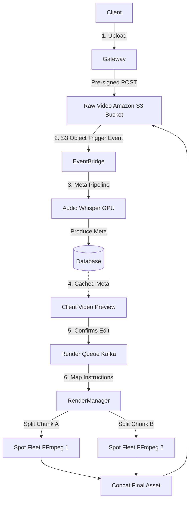

# Q4. AI Video Editing Pipeline

## 1. Problem Statement
Users upload raw videos and want automated editing (cuts, subtitles, highlights). The pipeline must efficiently manipulate raw heavy media.

## 2. Requirements
1. Upload video via API.
2. Detect scenes and segments.
3. Generate subtitles using speech-to-text.
4. Identify highlights (important segments).
5. Apply edits (trim, captions, enhancements).
6. Store edited video and metadata.
7. Allow users to preview intermediate results.

## 3. Follow-up Questions
* How will you design schema for video segments and edits?
* How will you process large video files efficiently?
* How do you parallelize video processing?
* How do you manage storage for large media?

---

## 4. Schema Design (Fields)

* **`RawVids`**: `id`, `user_id`, `raw_s3_url`, `fps`, `duration`, `status`
* **`MetadataPayloads`**: `video_id`, `subtitles_vtt_blob`, `scene_boundaries` (JSON intervals), `high_impact_zones` (JSON)
* **`VideoSegments`**: `id`, `video_id`, `start_sec`, `end_sec`, `category`, `snippet_url`
* **`EditJobs`**: `id`, `video_id`, `user_instructions_param` (JSON), `status`, `final_s3_url`

---

## 5. High-Level Design (HLD) & Explanatory Walkthrough



### Explanatory Walkthrough (Teaching Notes)
Architecting a heavy video operation boils down to one law: **Avoid rendering pixels as long as absolutely possible.** Compute is expensive; metadata text is virtually free.

**1. S3 Pre-signed Uploads**: For large 5GB media files, dragging them through API Gateway limits will fail. The client requests a secure presigned upload URL from the API and blasts the file straight into an S3 bucket asynchronously.
**2. Intelligence Extraction**: An S3 trigger invokes our AI. To prevent massive instances from churning 4K frames, we perform a lightweight extraction: we pull *only* the audio layer from the MP4 and throw it to Whisper STT. We generate JSON boundaries (e.g. `[12.5s -> 18.0s is a highlight]`).
**3. The Virtual Preview**: The user opens their dashboard. We don't render a new video! We pass the original massive video into the React player and feed the metadata JSON to the UI, commanding the JavaScript player to skip instantly from 18 seconds back to 10. The user gets a "preview" generated entirely on the frontend via JS mapping.
**4. Hard Rendering**: Once the user approves the edits, we queue up a severe compute array. We chunk the video horizontally logically (using FFmpeg split instructions), compress and burn-in subtitles across 10 distinct servers, and cleanly stitch the output together without dropping a frame.

---

## 6. LLD, Thought Process & Failure Handling

* **Processing Large Files Efficiently (Parallelization)**:
  How do you scale? It fundamentally requires Splitting, Encoding, and Concatenating. We send byte-range commands to 5 workers indicating "Hey, transcode frames 0-5000", while worker B does 5001-10000. When they return, we run an `ffmpeg concat muxer` to merge streams losslessly without doing another pass. Let instances do the small bits.
* **Storage for Large Media Limits**:
  We utilize S3 Lifecycle Policies. Raw inputs get moved to Amazon Glacier Deep-Archive automatically after 14 days. Rendered derivatives live in Standard tier. We don't keep duplicate intermediate `.flac` audio rips beyond worker execution.

---

## 7. Follow-up SQL Queries

**1. UI Scrubbing / Feed Highlights:**  
*Fetch highlight scenes mapped intelligently by the system for the React player timeline markers.*
```sql
SELECT start_sec, end_sec, snippet_url
FROM video_segments
WHERE video_id = 'user-video' AND category = 'high-retention'
ORDER BY start_sec ASC;
```

**2. Watchdog (Stuck Processing Pipes):**  
*Identify heavyweight video jobs that died without throwing an API catch payload over the last 2 hours.*
```sql
SELECT id, video_id, status 
FROM edit_jobs
WHERE status = 'rendering' AND updated_at < NOW() - INTERVAL '2 hours';
```

**3. Instruction Analytics:**  
*Discover popular platform use-cases by plucking nested JSON edit instructions directly inside the Postgres layer.*
```sql
SELECT user_instructions_param->>'effect_type' AS requested_effect, COUNT(*) as usages
FROM edit_jobs
GROUP BY requested_effect
ORDER BY usages DESC;
```

**4. Barrier Sync Completion Check:**  
*Since segments are encoded asynchronously, a map-reduce style query confirms if the overarching video is ready for Final Stitching.*
```sql
SELECT video_id, BOOL_AND(status = 'rendered') as is_ready_to_stitch
FROM video_segments
WHERE video_id = 'target-video-uuid'
GROUP BY video_id;
```

**5. Abandoned Cart Pruning:**  
*Cleanly find multi-GB uploads where the user closed the UI and never requested a final rendering.*
```sql
SELECT r.id, r.raw_s3_url
FROM raw_vids r
LEFT JOIN edit_jobs e ON r.id = e.video_id
WHERE e.id IS NULL AND r.created_at < NOW() - INTERVAL '3 days';
```
