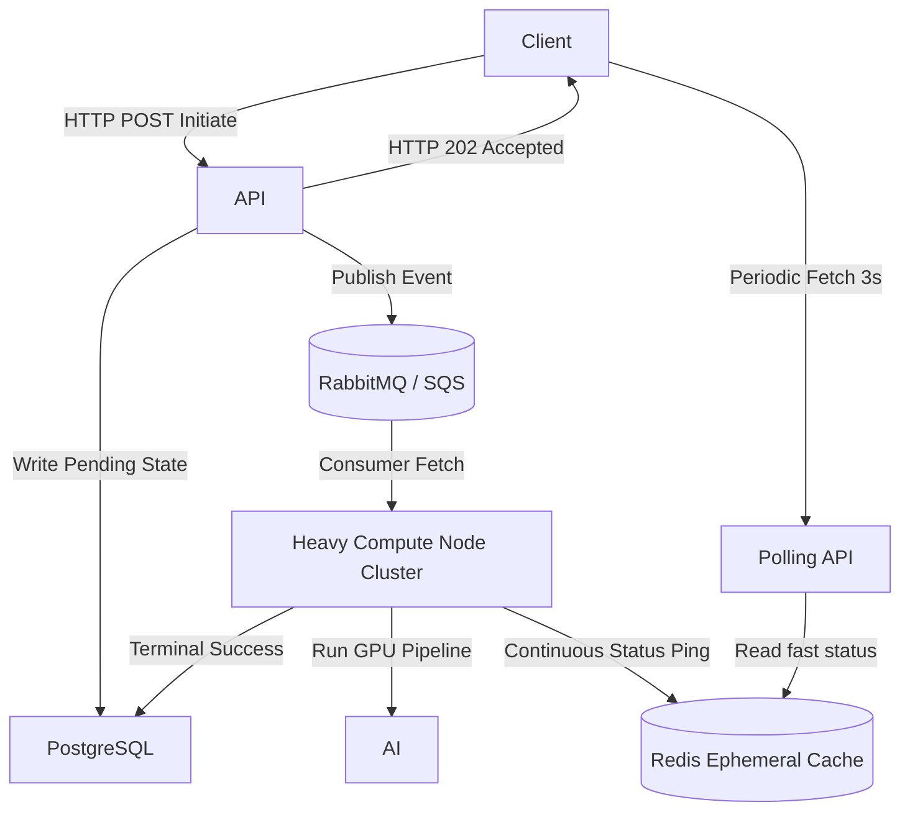

# Q6. Async AI Job Orchestration System

## 1. Problem Statement
Design a generic backend system to handle long-running AI tasks (video generation, transcription, etc.).

## 2. Requirements
1. Users submit jobs via API.
2. Jobs are queued and processed asynchronously.
3. Track job states (pending, running, failed, completed).
4. Support retries and failure handling.
5. Store job results and logs.
6. Allow users to query job status.

## 3. Follow-up Questions
* What schema will you use for jobs and tasks?
* How do you ensure idempotency?
* How do you handle retries and dead-letter queues?
* How do you scale workers?

---

## 4. Schema Design (Fields)

* **`OrchestrationJobs`**: `id`, `user_id`, `job_type_label` (video, stt, inference), `global_status`, `result_payload` (JSON URL)
* **`JobTasks`**: `id`, `job_id`, `state`, `task_params` (JSON), `retry_attempts`, `max_retries`, `execution_log_dump`
* **`DeadLetters`**: `id`, `failed_task_id`, `reason`, `dumped_at`

---

## 5. High-Level Design (HLD) & Explanatory Walkthrough



### Explanatory Walkthrough (Teaching Notes)
When AI processes take anywhere from 1 minute to 5 hours, you cannot tie network connections to active processes. Standard HTTP requests drop after 60 seconds. We solve this by decoupling state from execution.

1. **Submission & Acknowledgement**: When a user submits an action, the API creates a record tracking a new Job. The critical part here is that the API responds almost immediately with an `HTTP 202` Status ("Hey, I got the request, here's your Tracker ID") without doing the physical work. 

2. **Enqueing**: The job specification is securely deposited into a reliable message broker format (like AWS SQS).

3. **Execution**: A worker node specifically optimized for that job type (say, a GPU instance) natively listens to the queue. It picks up the request. To prevent users from waiting blindly, the worker calculates its progress occasionally and pushes `"Status: 40%"` to Redis in-memory.

4. **Discovery**: The user's web browser queries the backend polling route every 3 seconds. The API reads the lighting-fast Redis key, returns `40%`, and renders a progress bar for the user seamlessly.

---

## 6. LLD, Thought Process & Failure Handling

* **Message Delivery Semantics (At-Least-Once vs Exactly-Once)**: 
  Standard robust queues like RabbitMQ or AWS SQS operate on an **"At Least Once"** delivery model. This guarantees a worker *will* receive the message, but during network stutters, SQS might accidentally deliver the exact same job to *two* workers simultaneously. Achieving true "Exactly-Once" horizontally via Kafka is complex. Instead, we embrace "At-Least-Once" network delivery but enforce **Exactly-Once Business Logic** using the Idempotency Guarantee (the `FOR UPDATE SKIP LOCKED` SQL query below). If two workers receive the same job, only one can successfully lock the DB row; the other safely drops the duplicate payload.

* **Scaling Workers (Depth Metrics)**:
  How do we scale automatically to save money? We use metric-driven alarms against the **Queue Depth**. If there are 500 tasks waiting in SQS, CloudWatch automatically spins up 10 new EC2 Pods. Once the queue drains back to 0, they spin down.

* **Dead Letter Queues vs Retries**:
  If a task fails its try-catch logic, the worker increments `retry_attempts`. But if it hits the `max_retries` cap (e.g. 3 attempts), it means the job is fundamentally poisoned (bad file, unworkable prompt). To keep it from bouncing infinitely and costing GPU money, the system permanently removes it from the main queue and maps it to the `DeadLetters` table.

---

## 7. Follow-up SQL Queries

**1. Pessimistic Row Locking (Worker Claim logic):**  
*The native concurrency lock preventing two spot instances from rendering the same job simultaneously, guaranteeing Exactly-Once execution despite At-Least-Once delivery.*
```sql
UPDATE job_tasks 
SET state = 'running', execution_log_dump = 'Started by Process_44'
WHERE id = (
    SELECT id FROM job_tasks WHERE state = 'pending' ORDER BY created_at ASC LIMIT 1 FOR UPDATE SKIP LOCKED
)
RETURNING id, task_params;
```

**2. Dead Letter Analysis:**  
*For the engineering team: which specific AI task queues are crashing the hardest and causing fatal unrecoverable errors?*
```sql
SELECT j.job_type_label, COUNT(d.id) AS fatal_failure_count
FROM dead_letters d
JOIN job_tasks t ON d.failed_task_id = t.id
JOIN orchestration_jobs j ON t.job_id = j.id
GROUP BY j.job_type_label
ORDER BY fatal_failure_count DESC;
```

**3. Queue Starvation Monitoring:**  
*Find AI Task requests that have sat in 'pending' status endlessly, signaling that the GPU fleet is totally starved.*
```sql
SELECT id, job_id, created_at, EXTRACT(EPOCH FROM NOW() - created_at) AS wait_time_seconds
FROM job_tasks
WHERE state = 'pending'
ORDER BY created_at ASC
LIMIT 10;
```

**4. Provider Flakiness Profiler:**  
*Determine how faulty a third-party AI platform is by calculating the Average Retries needed to successfully return output.*
```sql
SELECT job_type_label, AVG(retry_attempts) as average_retry_cycles_required
FROM job_tasks t
JOIN orchestration_jobs j ON t.job_id = j.id
WHERE t.state = 'completed'
GROUP BY job_type_label;
```

**5. Completed Queue Expiration:**  
*Clean up the tracking table to prevent Postgres index bloat on records successfully served to clients over 6 months ago.*
```sql
DELETE FROM orchestration_jobs 
WHERE global_status = 'completed' 
  AND created_at < NOW() - INTERVAL '6 months';
```


<script type="module">
  import mermaid from 'https://cdn.jsdelivr.net/npm/mermaid@10/dist/mermaid.esm.min.mjs';
  mermaid.initialize({ startOnLoad: false });
  document.addEventListener("DOMContentLoaded", function() {
    const blocks = document.querySelectorAll('pre code.language-mermaid');
    blocks.forEach(function(block) {
      const div = document.createElement('div');
      div.className = 'mermaid';
      div.textContent = block.textContent;
      const parent = block.closest('.highlighter-rouge') || block.closest('pre');
      if (parent) {
        parent.replaceWith(div);
      }
    });
    mermaid.run();
  });
</script>
