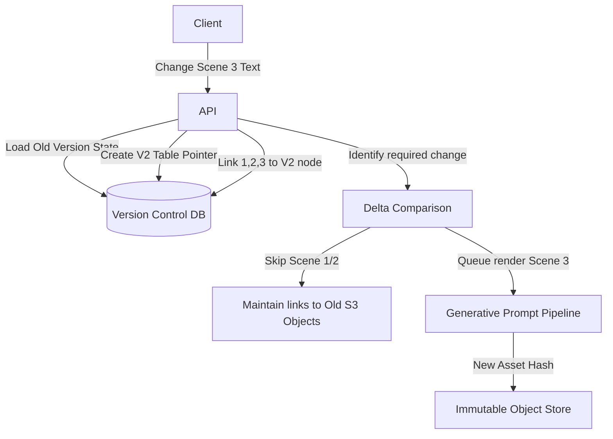

# Q7. AI Content Creation with Versioning

## 1. Problem Statement
Users create AI-generated content (videos, scripts, images) and want to iterate on versions.

## 2. Requirements
1. Generate initial content from prompt.
2. Allow edits (regenerate specific parts).
3. Maintain version history.
4. Store differences between versions.
5. Allow rollback to previous versions.
6. Optimize storage for multiple versions.

## 3. Follow-up Questions
* How will you design schema for versioning?
* How do you store diffs vs full copies?
* How do you re-run only partial pipelines?
* How do you manage dependencies between versions?

---

## 4. Schema Design (Fields)

* **`Projects`**: `id`, `user_id`, `current_head_version_id` (pointer)
* **`Versions`**: `id`, `project_id`, `parent_version_id` (NULL if origin base), `commit_delta_prompt`, `created_at`
* **`Snapshots`** (For Text): `version_id`, `full_json_payload`, `diff_patch`
* **`HashedMediaAssets`**: `media_hash_id`, `s3_url`, `asset_type`

---

## 5. High-Level Design (HLD) & Explanatory Walkthrough



### Explanatory Walkthrough (Teaching Notes)
When applying iterative version control to AI systems, the architecture fundamentally follows Git paradigms: Trees, Commits, and Content-Addressable Storage.

**1. The "Commit" Concept**: When a user creates Version 1, we generate 5 unique scenes. We insert a `Version` row linking to the master `Project`. We store exactly what was generated.
**2. The State Delta**: The user selects scene 3 and says "Make this angrier", pressing Generate. Our system looks at the current Head. It realizes scenes 1, 2, 4, and 5 were untouched. It bypasses the AI completely for those sections and passes the *newly isolated* prompt exclusively to the AI Generator for Scene 3. 
**3. State Preservation via Hash Pointers**: The AI hands back the angry video clip. We calculate an exact SHA-256 hash of the video block and save it to S3 as `[hash].mp4`. We then write V2 to the database. V2's internal snapshot simply stores pointers: `[Hash1, Hash2, NEW_Hash3, Hash4]`. Rollback? Simply move the `current_head_version_id` back to V1 pointer.

---

## 6. LLD, Thought Process & Failure Handling

* **Storing Diffs vs Full Copies**:
  If the payload is purely textual scripts, trying to calculate and apply JSON patch differences natively inside Postgres causes huge CPU spikes on reads. Text is so tiny (a few KB) that it is geometrically vastly superior to natively save the Full Copy inside every `Snapshot` row.
  However, for *Video Assets*—this is strictly differential hashing. You never, ever save a duplicate 500MB MP4 file if the user didn't modify it. You reuse the S3 string pointer referencing the unaltered asset.
* **Managing Branching & Dependencies**:
  Every version has a `parent_version_id`. This builds a directed graph. If a user modifies an old branch, the new child inherits whatever was active exactly at that point in time. 
* **Garbage Collection Optimization**:
  As users iterate 300 times searching for the perfect image generation, our UI masks old assets, but S3 keeps them securely. We write an orchestrator Cronjob. Once a month, it queries our databases. Any video blob resting in S3 that has 0 hash references across all graphs is considered Orphaned and permanently expunged.

---

## 7. Follow-up SQL Queries

**1. Reverting the Project State (Rollback):**  
*Instantly shifts the entire User Interface and asset timeline back to a previous iteration.*
```sql
UPDATE projects 
SET current_head_version_id = 'historical-v-uuid' 
WHERE id = 'project-uuid';
```

**2. Rebuilding the Graph Array (Recursive Common Table Expression):**  
*Traverses the database recursively to reconstruct the entire lineage history tree for the UI Timeline.*
```sql
WITH RECURSIVE VersionHistory AS (
    SELECT id, parent_version_id, commit_delta_prompt, 1 AS branch_depth
    FROM versions WHERE id = 'latest-v-uuid'
    
    UNION ALL
    
    SELECT v.id, v.parent_version_id, v.commit_delta_prompt, vh.branch_depth + 1
    FROM versions v
    INNER JOIN VersionHistory vh ON v.id = vh.parent_version_id
)
SELECT * FROM VersionHistory ORDER BY branch_depth ASC;
```

**3. Detecting Orphaned Deep-Storage Assets (S3 Garbage Collection):**  
*Identifies massive generated MP4s that are not legally referenced by ANY active version branch left in the Postgres tables.*
```sql
SELECT m.media_hash_id, m.s3_url 
FROM hashed_media_assets m
LEFT JOIN snapshots s ON m.media_hash_id = s.full_json_payload->>'primary_video_hash'
WHERE s.version_id IS NULL;
```

**4. Optimistic Version Locking:**  
*Prevents double-updates if Alice and Bob are collaborating on a canvas and press "Regenerate" at the precise exact millisecond.*
```sql
UPDATE projects
SET current_head_version_id = 'new-version-uuid'
WHERE id = 'project-uuid' AND current_head_version_id = 'expected-old-version-uuid'
RETURNING id;
-- Application checks: if rows returned is 0, throw a Branch Conflict Error to the user!
```

**5. "Who's working hardest?" Analytics Iteration count:**  
*Discovers the most heavily iterated-upon active AI generation projects on the server based on sheer commit history.*
```sql
SELECT project_id, COUNT(id) as total_version_commits
FROM versions
GROUP BY project_id
ORDER BY total_version_commits DESC
LIMIT 5;
```
