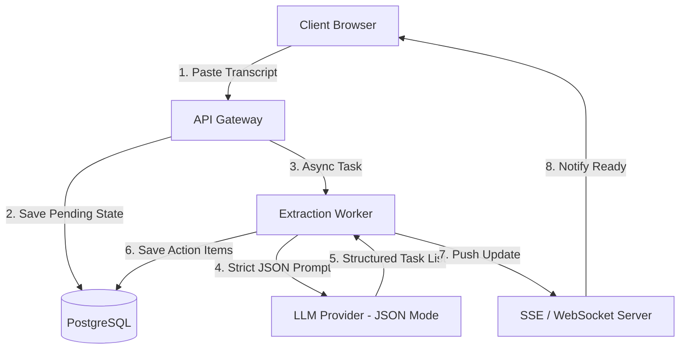

# Q8. Meeting Action Items Tracker

## 1. Problem Statement
Build a mini workspace application where users can paste raw meeting transcripts, and the system automatically extracts a list of action items (with task description, owner, and due date). Users can edit, add, delete, and mark these items as done, while viewing a history of past transcripts.

## 2. Requirements
1. Receive raw meeting transcript text as input.
2. Process transcript through an LLM to extract structured action items (Task, Owner, Due Date).
3. Provide CRUD operations on extracted action items (Edit, Add, Delete, Mark Done).
4. Maintain a dashboard of the last 5 transcripts processed.
5. Persist transcript history and associated tasks for future retrieval.

## 3. Follow-up Questions
* How do you enforce the LLM to return valid, parsable data instead of conversational text?
* How will you handle exceedingly long meeting transcripts that exceed LLM context windows?
* How do you handle schema updates if fields (e.g., Priority) are added later?

---

## 4. Schema Design (Fields)

* **`Users`**: `id`, `email`, `created_at`
* **`Transcripts`**: `id`, `user_id`, `raw_text`, `status` (processing, completed, failed), `created_at`
* **`ActionItems`**: `id`, `transcript_id`, `owner_name`, `due_date` (timestamp), `description`, `is_done` (boolean)

---

## 5. High-Level Design (HLD) & Explanatory Walkthrough



### Explanatory Walkthrough (Teaching Notes)
The primary challenge is ensuring reliability from the LLM. If the LLM returns plain text instead of JSON, the backend will fail to map the tasks.

1. **State Tracking**: Because LLM inference can take 10-30 seconds, immediately return an ID to the client (`Transcript` state = `processing`) and process it asynchronously.
2. **Structured Outputs**: We utilize strict JSON mode (or OpenAI Structured Outputs / function calling). We provide a JSON schema for `[ { task, owner, date } ]`.
3. **Map-Reduce for Large Texts**: If a 3-hour meeting transcript exceeds token limits, the worker chunks the text into 30-minute segments. It runs action-item extraction on each chunk in parallel, then concatenates the results arrays.

---

## 6. LLD, Thought Process & Failure Handling

* **Handling LLM JSON Parse Failures**: 
  Even with JSON mode, the model might produce trailing commas or invalid characters. The backend must wrap the parsed response in a `try/catch`. If parsing fails, use an auto-retry loop with a lower `temperature` for more deterministic output.
* **Fuzzy Identifiers**:
  The meeting might say "John will do this." If the system must map "John" to an actual user ID in the future, it requires a secondary resolution step against a corporate active directory. For now, strings are safer.

---

## 7. Follow-up SQL Queries

**1. Fetch Last 5 Transcripts for a User:**  
```sql
SELECT id, status, created_at 
FROM transcripts 
WHERE user_id = 'user-123' 
ORDER BY created_at DESC 
LIMIT 5;
```

**2. Retrieve Dashboard Open Action Items:**  
```sql
SELECT a.description, a.owner_name, a.due_date 
FROM action_items a
JOIN transcripts t ON a.transcript_id = t.id
WHERE t.user_id = 'user-123' AND a.is_done = false
ORDER BY a.due_date ASC NULLS LAST;
```

**3. Update Task Completion Status:**  
```sql
UPDATE action_items 
SET is_done = true 
WHERE id = 'task-456' AND transcript_id = 'transcript-789';
```

<script type="module">
  import mermaid from 'https://cdn.jsdelivr.net/npm/mermaid@10/dist/mermaid.esm.min.mjs';
  mermaid.initialize({ startOnLoad: false });
  document.addEventListener("DOMContentLoaded", function() {
    const blocks = document.querySelectorAll('pre code.language-mermaid');
    blocks.forEach(function(block) {
      const div = document.createElement('div');
      div.className = 'mermaid';
      div.textContent = block.textContent;
      const parent = block.closest('.highlighter-rouge') || block.closest('pre');
      if (parent) {
        parent.replaceWith(div);
      }
    });
    mermaid.run();
  });
</script>
