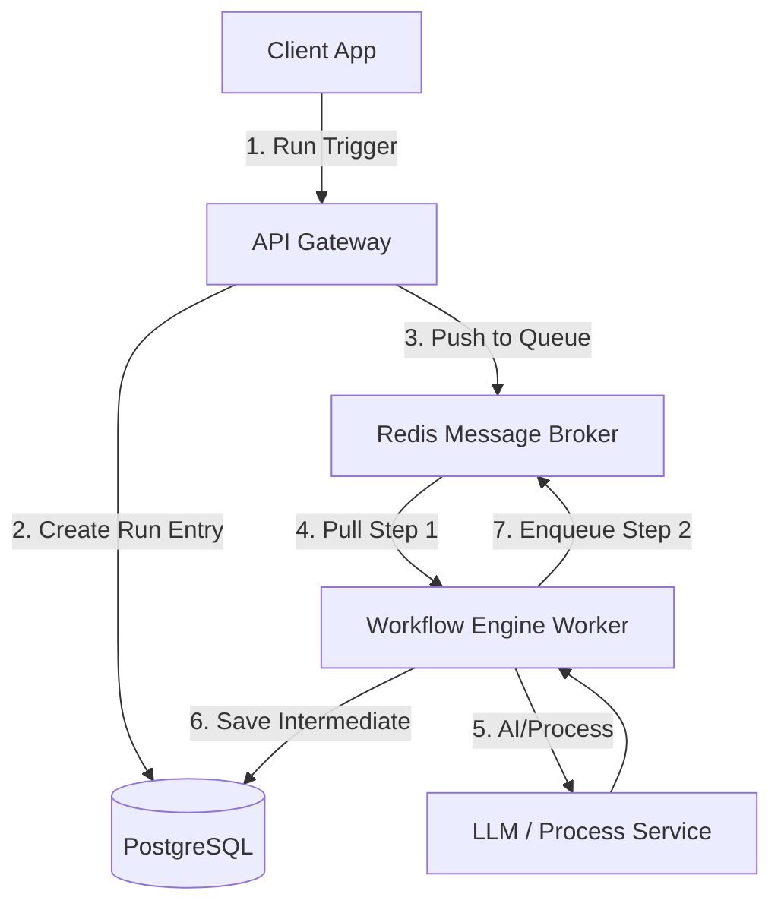

# Q9. Workflow Builder Lite

## 1. Problem Statement
Build a small automation runner where users can chain together 2–4 sequential text-processing steps (e.g., Clean Text → Summarize → Extract Keywords → Tag Category). Users run the workflow on input text, view the output at each step, and track the history of the last 5 runs.

## 2. Requirements
1. Design an interface to define a pipeline of sequential task types.
2. Accept dynamic text input to initiate a workflow run.
3. Pass the output payload of Step N directly to the input of Step N+1.
4. Persist and expose intermediate outputs so users can inspect where logic failed or succeeded.
5. Provide a dashboard of historical runs.

## 3. Follow-up Questions
* How do you prevent a workflow loop or excessively long chains?
* How is state preserved across multiple distributed workers?
* How do you handle failure in step 3 so the user doesn't lose step 1 and 2?

---

## 4. Schema Design (Fields)

* **`Workflows`**: `id`, `user_id`, `name`, `configuration` (JSON block defining the array of ordered step types)
* **`Runs`**: `id`, `workflow_id`, `input_payload`, `status` (running, failed, completed), `created_at`
* **`StepExecutions`**: `id`, `run_id`, `step_index`, `step_type`, `input_text`, `output_text`, `status`, `duration_ms`

---

## 5. High-Level Design (HLD) & Explanatory Walkthrough



### Explanatory Walkthrough (Teaching Notes)
Building a pipeline requires separating the *definition* of the workflow from its *execution*. 

1. **Idempotent Step Execution**: When a Run is requested, the system reads the `configuration` JSON to know the ordered blueprint. It creates a `Run` database row and queues the first step index (0).
2. **Event-Driven Chaining**: The Worker pulls Step 0 from the queue, performs the logic (e.g., calling an LLM for translation). Once it returns, it **writes the output to `StepExecutions`**. The worker then dynamically enqueues Step 1, injecting Step 0's output text as Step 1's input payload.
3. **Resiliency**: Because we dump output to the DB at every step, if Step 2 crashes due to an API timeout, Step 1's hard work is safely persisted. 

---

## 6. LLD, Thought Process & Failure Handling

* **Timeouts & Dead Letter Queues (DLQ)**:
  LLMs are notoriously slow. A step worker should have a long TTL (e.g., 5 mins). If a worker crashes midway, the queue visibility timeout should expire, allowing another worker to retry the specific step safely without restarting the entire run from Step 0.
* **Schema Validation Between Nodes**:
  If Step 1 (Summarize) is supposed to output plain text, but Step 2 evaluates it against a prompt, ensure explicit validation boundaries so corrupt data doesn't cascade through the pipeline.

---

## 7. Follow-up SQL Queries

**1. Fetch Full History of a Run Ecosystem:**  
```sql
SELECT r.id AS run_id, s.step_index, s.step_type, s.output_text, s.status
FROM runs r
JOIN step_executions s ON r.id = s.run_id
WHERE r.workflow_id = 'wf-123'
ORDER BY r.created_at DESC, s.step_index ASC;
```

**2. Resume / Identify Failed Steps:**  
```sql
SELECT id, run_id, input_text 
FROM step_executions 
WHERE status = 'failed' AND run_id = 'run-456';
```

**3. Pipeline Performance Telemetry:**  
```sql
SELECT step_type, AVG(duration_ms) as avg_latency
FROM step_executions
WHERE status = 'completed'
GROUP BY step_type;
```

<script type="module">
  import mermaid from 'https://cdn.jsdelivr.net/npm/mermaid@10/dist/mermaid.esm.min.mjs';
  mermaid.initialize({ startOnLoad: false });
  document.addEventListener("DOMContentLoaded", function() {
    const blocks = document.querySelectorAll('pre code.language-mermaid');
    blocks.forEach(function(block) {
      const div = document.createElement('div');
      div.className = 'mermaid';
      div.textContent = block.textContent;
      const parent = block.closest('.highlighter-rouge') || block.closest('pre');
      if (parent) {
        parent.replaceWith(div);
      }
    });
    mermaid.run();
  });
</script>
